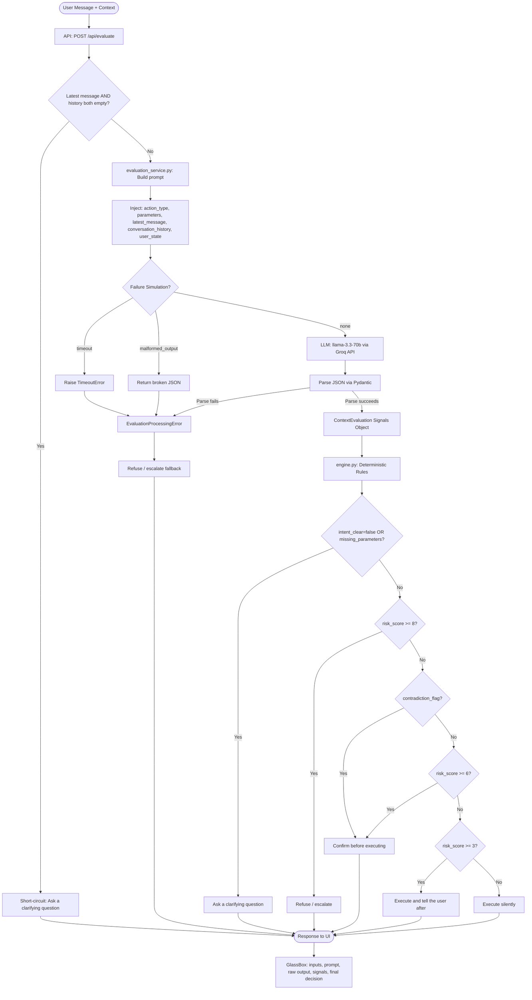

# alfred_ Execution Decision Layer

This is my submission for the alfred_ application challenge. The task was to design and build the execution decision layer — the part of alfred_ that decides whether to act silently, notify the user after, ask for confirmation, ask a clarifying question, or refuse entirely.

---

## Pipeline

---

## How the System Works

The core idea is a hybrid pipeline: one layer handles the messy language understanding, and a deterministic rules engine makes the final call. The evaluator never directly outputs "Execute silently" or "Refuse" — it outputs structured signals, and the rules engine decides what to do with them.

The API and UI both accept the full decision payload: proposed action, proposed parameters, latest message, conversation history, and a structured `user_state` object for standing constraints, trust tier, and user preferences. The details view exposes those inputs alongside the evaluation prompt, raw response, computed signals, and final parsed decision.

This split matters because the final decision needs to be predictable and auditable. If you want to raise the confirmation threshold for financial actions, you change one number in the rules engine. You don't re-prompt.

---

## The Signals, and Why I Chose Them

**Intent clarity** is the first gate. If I can't state precisely what the user wants, I shouldn't act. This catches vague messages like "do that thing we talked about" before any risk evaluation happens.

**Missing parameters** catches structural incompleteness. Some actions can't be executed regardless of intent — "send it" with no recipient in scope is a dead end. These are caught deterministically before risk is even scored.

**User state** is additional context, not a verdict by itself. It lets the system factor in things like standing instructions, trust tier, notification preferences, or previous approvals when scoring risk and checking whether execution would violate a user-level constraint.

**Contextual risk score** (1–10) is the part that benefits most from flexible language understanding. Risk isn't a property of an action type — it's a property of the action in context. Scheduling a meeting is low risk. Sending a pricing proposal to an external client mid-negotiation is not. The system scores the specific situation, not the category.

**Contradiction flag** is the most important signal for avoiding bad outcomes. The hardest failure mode is treating the latest message in isolation. If the user said "hold off until legal reviews" and then said "yep send it" a few messages later, a naive system executes. This signal catches that by requiring the evaluator to compare the latest message against any prior constraints in the history.

**Reasoning** is included because it forces the evaluator to produce an explanation, which reduces shallow pattern-matching. It also gives us an auditable rationale we can show in the UI.

---

## How Responsibility Is Split

The evaluation layer handles everything that requires understanding language: parsing intent from messy phrasing, detecting implicit contradictions across a conversation thread, estimating contextual risk, and identifying what parameters are structurally missing.

The rules engine (`engine.py`) handles everything that should be deterministic: the final verdict, hard safety floors (risk ≥ 8 always refuses, no exceptions), short-circuit guardrails before the evaluator is called, and failure fallback. Any exception from the evaluation layer — timeout, malformed output, anything — defaults to refuse. The system never executes on uncertainty.

---

## Prompt Design

The system prompt frames the evaluator as a reviewer, not an action-taker. This framing is deliberate. If you tell it it's deciding whether to execute, it will try to be helpful and lean toward execution. If you tell it its job is to evaluate the context and return a JSON assessment, it stays in its lane.

The user prompt includes the proposed action, parameters, the latest message, the full conversation history, and structured user state. Passing the full history is the key design decision that makes contradiction detection possible, while user state lets the evaluator honor standing instructions and preferences that are not explicit in the latest turn. Without that broader context, the Acme example from the challenge brief would just execute.

---

## Failure Modes

Timeouts are caught with a 5-second limit. Malformed JSON from the evaluator fails Pydantic validation. Both are caught in the evaluation service and bubble up to `main.py`, which returns a "Refuse / escalate" response with the error surfaced in the pipeline data.

Missing context (empty message and no history) is caught before the evaluation step runs at all — it short-circuits to "Ask a clarifying question" immediately.

The default safe behavior throughout is: when uncertain, do nothing irreversible. Failures fall toward refusal, not execution.

Scenarios 7, 8, and 9 in the sidebar demonstrate the failure paths live in the UI: missing context, simulated timeout, and simulated malformed output.

---

## Evolving for Riskier Tools

As alfred_ gains access to more powerful tools — financial transactions, file deletion, contact management, calendar writes on behalf of others — a few things break down.

The most immediate gap is that risk scoring is still fully delegated to the evaluator. For casual actions that's fine, but a `delete_emails` call should have a minimum floor of 7 in code regardless of how the user phrases the request. Language models shouldn't be the last line of defense against irreversible actions.

Reversibility is a dimension missing from the current design entirely. Sending an email and drafting one are not the same risk. An irreversibility flag per tool type, factored in as a multiplier before the rules engine runs, would capture this cleanly without touching any prompts.

User trust tiers should also feed into the threshold, not just the evaluation. A user who has correctly confirmed 50 actions should face less friction than someone new. That state lives outside the conversation and needs to be injected at the rules layer.

The harder long-term problem is sequential reasoning. Right now the system evaluates one action at a time. If alfred_ is mid-way through a multi-step task and an earlier step produced unexpected output, nothing in the current design catches that before the next action fires.

---

## What I'd Build Next

The thing I'd prioritize most is per-user memory of standing constraints. Today contradiction detection is per-conversation. But "never send pricing without legal approval" is something a user might say once and expect to hold forever. A persistent constraint store that gets injected into the system prompt as a "standing instructions" block would make the system meaningfully more trustworthy over time.

After that, a proper tool registry. Right now action types are freeform strings. Making them structured entries with base risk scores, reversibility flags, required parameters, and whether they touch external parties would let the rules engine do a lot more work before the evaluator even gets involved.

Then an offline eval harness. The hardest part of owning a decision layer is knowing whether a change made things better or worse. A labeled dataset of scenarios with ground-truth decisions, run against the full pipeline on every code change, is what turns this from a prototype into something you can ship with confidence. False-silent-executions and false-refusals have very different costs — you need to track them separately.

---

## Local Setup

For the backend, `cd` into `backend`, install requirements, set `GROQ_API_KEY` in a `.env` file (get a free key at console.groq.com), and run `uvicorn main:app --reload`.

For the frontend, `cd` into `frontend`, run `npm install`, then `npm run dev`. The dev server proxies `/api` calls to `localhost:8000` automatically via the Vite config, so both can run independently.

---

## Deployment

The backend serves the built React app as static files, so a single Render web service hosts everything. Push the repo to GitHub, create a new Web Service on Render pointed at the repo, and it will auto-detect `render.yaml`. The only manual step is setting `GROQ_API_KEY` in the Render environment variables dashboard. See `deploy_instructions.txt` for the full walkthrough.
